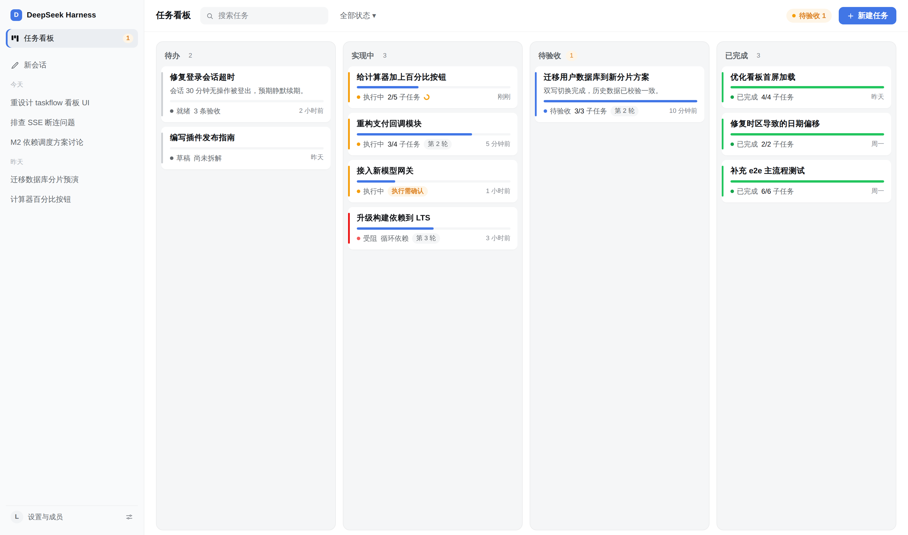
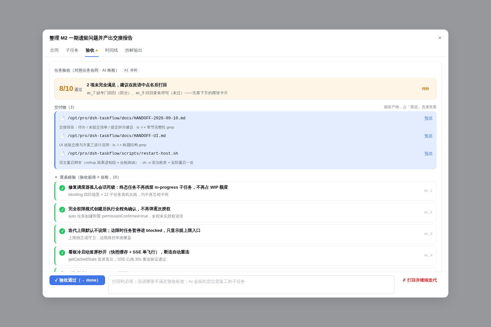
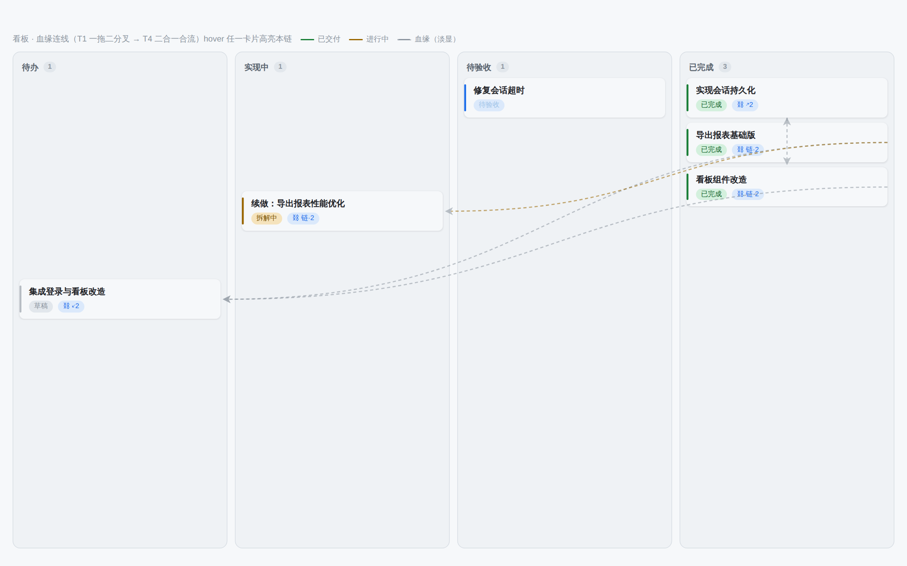
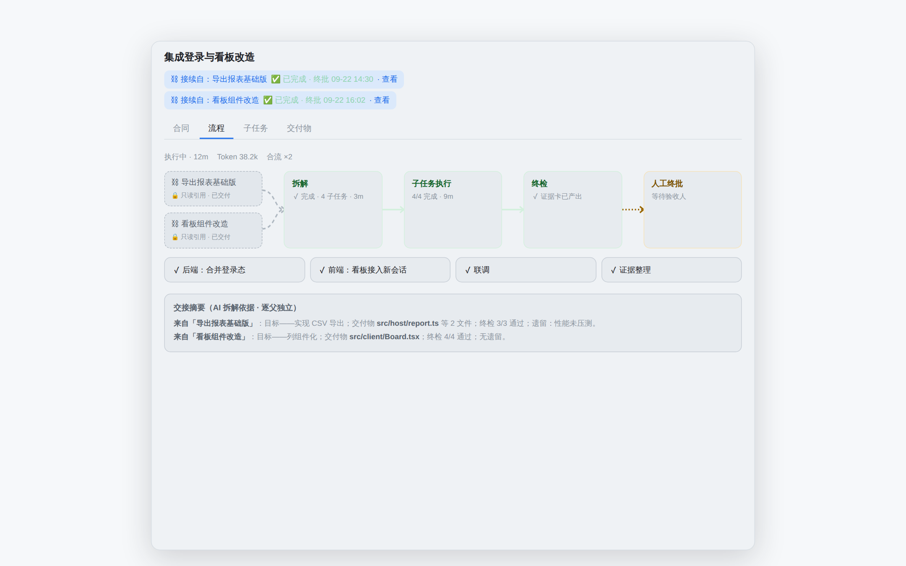

# dsh-taskflow · AI 合同式任务看板

> DeepSeek Harness (dsh) Web 插件 —— 你创建任务（验收标准可给可不给），AI 自己拆解、自己实现、自己举证；人来验收，通过才算 done，不通过打回继续迭代，全过程状态留痕。



## 定位一句话

**人与 AI 之间的合同管理器**：卡片不是提示词的容器，而是一份合同（做什么 + 怎么算做完 + 准许动用什么）；看板是这块共享黑板的实时视图；调度器的职责是把「就绪的合同」喂给会话，验收人的职责是让「done」两个字有含金量。

## 核心功能

### 📋 合同式建卡

创建任务时写下目标与验收标准（可留空交给 AI 起草），并可选择执行方式：

- **权限模式** —— 「完全权限」AI 全程自主执行不弹审批；「需要审批」涉提权操作先暂停等你裁决，配执行看门狗防无声挂起；
- **能力预设** —— 修 Bug / 新功能 / 技术调研 / 清理整理，只影响 AI 怎么拆、验收标准往哪起草；
- **任务级覆盖** —— 工作目录钉定（目录选择器 + 沙箱可写根限定）、并发数（1–8）、模型（独立于全局两槽）、迭代上限（30/60/90/无限）；
- **模板与触发** —— 内置模板一键预填；cron 定时建卡 + webhook 门控远程建卡（CI/脚本可用），无人值守跑通「定时建卡 → 自动推进 → 等验收」。

### 🤖 AI 拆解与执行

任务进入「实现中」后由 AI 自动拆解为子任务 DAG 并按依赖调度执行：WIP 并发上限（全局 1–8，全局/任务级取 min）、依赖 DAG 守卫防死锁、受挫显式标记「受阻 + 原因」、迭代轮数与 Token 用量回采落库。

### ⚖️ 验收只对合同，过程归 AI

- 子任务全部完成后，AI 自动跑**任务级终检**，对照验收标准产出整体交付证据卡（失败自动重试 1 次，仍失败兜底进 review 可人工补跑）；
- 验收工作台以任务级判定面优先：结论带（通过率 / 差额）+ 逐条核验（pass 绿 / partial 橙 / fail 红），子任务降级为「执行过程举证」折叠附录，无需逐个验收；
- **打回不选子任务**：人只写批语，AI triage 自动定位返工范围（未点名的不重跑，沿依赖 DAG 回退下游，定位失败回退全量）;
- **交付物一等公民**：证据可声明 artifacts（路径 + 说明 + 核验方式），验收台/产物页直接只读预览（≤256KiB、二进制拒显、仅放行声明过的路径），不用离开看板翻文件。



### 🔗 任务接续与血缘 DAG

done 卡可以「接续新任务」、review 可「确认并接续」——签的是**新合同**而非重开老合同（状态机零改动）：

- `basedOn` 建卡：父须 done、禁环、上限 10 个父；
- 逐父独立交接摘要注入拆解提示，pins 缺省继承第一父；
- 看板卡片带链徽标，实时渲染血缘连线（hover 高亮本链）；
- 任务详情「流程」tab：完整管线 **AI 拆解 → 子任务 DAG → AI 终检 → 人工终批** 的蛇形流程图，点任意节点展开执行轨迹（执行中实时滚动 AI 进度便签）。





### 🔔 通知、批量与统计

- 提权审批落库 + 全局通知栏 + 一键跳转裁决；浏览器系统通知（新进待验收 / 新审批，opt-in）；
- 批量操作：批量归档、批量验收（通过所选 / 打回所选共用批语走 AI triage）；
- 周期统计浮层：7/30 天吞吐、一次通过率、平均迭代轮次、拆解采纳率，空账本不编造；
- 全局模型设置（拆解/执行两槽独立配置，即改即落盘）、WIP 与调度参数进设置浮层。

## 工作流一览

```
你建卡（目标 + 验收标准 + 权限/能力/目录/模型）
        │
        ▼
  AI 拆解 ──► 子任务 DAG 执行 ──► AI 任务级终检 ──► 待验收
                    ▲                            │
                    │                   通过 ────┤ 打回（AI triage 定位返工范围）
                    └────────────────────────────┘
        done 卡可「接续新任务」签新合同，血缘成 DAG
```

## 与现有能力的分工

| 能力 | 层面 | taskflow 的关系 |
|---|---|---|
| `/goal` | 会话内完成驱动循环 | 不抢它的活：卡片运行时，会话内部照常用 goal |
| `/schedule` | 会话内定时提醒 | 不重叠 |
| `dsh-task-board`（第三方） | cron 作业发射器 | 独立新项目，数据目录分离，可共存；本项目吸收其教训重新设计 |

## 安装与配置

**前置要求**：dsh 宿主 `0.1.2-rc.1+`；Node.js 18+；本仓库克隆到本地任意路径（下文以 `/opt/pro/dsh-taskflow` 为例）。

### 1. 构建插件

```sh
git clone https://github.com/LuckVd/dsh-taskflow.git /opt/pro/dsh-taskflow
cd /opt/pro/dsh-taskflow
npm install          # .npmrc 已带 legacy-peer-deps（dsh 包 npm peer 版本错位）
npm run build        # 产出 dist/（宿主模块 + 客户端 bundle）
```

### 2. 安装到 dsh 宿主 profile

```sh
dsh plugin --profile <name> add dsh-taskflow
```

该命令会把本包注册进 profile 的依赖与 bundles 组合层（等价于在 `~/.dsh/profiles/<name>/package.json` 的 `dsh.profile.bundles` 加入 `"dsh-taskflow"`、`dependencies` 加入本包），`cordis.patch.yml` 负责把插件插入宿主组合层。

**本地开发（免重复 add）**：把 profile 依赖指到本地目录，改完代码 `npm run build` 后重启宿主即生效：

```jsonc
// ~/.dsh/profiles/<name>/package.json
{
  "dsh": { "profiles": { "bundles": [ /* … */ "dsh-taskflow" ] } },
  "dependencies": {
    "dsh-taskflow": "link:/opt/pro/dsh-taskflow"
  }
}
```

### 3. 重启宿主

```sh
# 退出宿主进程后重新拉起，例如：
dsh --profile <name> --port 28080
```

浏览器打开宿主 Web 界面，侧栏出现「任务看板」入口即安装成功。数据落盘在 `~/.dsh/taskflow/`（ledger.json），与宿主会话数据相互独立。

### 插件配置（可选）

`cordis.yml` 中可覆盖插件配置：cron 定时建卡（`schedules[]`）、webhook 门控 token（`webhookToken`）等；全局模型 / WIP 并发等运行时配置在看板工具栏 ⚙ 设置浮层里改，即改即落盘。

### 代码地图

| 层 | 位置 | 说明 |
|---|---|---|
| protocol | `src/protocol/` | ledger schema v1、action 白名单、拆解输出/证据校验（纯 TS，零依赖） |
| host | `src/host/` | ledger 原子存储、状态机（T1–T10/S1–S6）、引擎（调度/证据门/打回迭代/恢复）、HTTP+SSE、dsh 适配器与插件入口 |
| client | `src/client/` | 看板/弹窗/验收页/流程图（React + `--dsw-alias-*` 主题变量）、纯视图模型、HTTP/SSE 传输 |

## 文档导航

| 文档 | 内容 |
|---|---|
| [`docs/REQUIREMENTS.md`](docs/REQUIREMENTS.md) | 需求文档：背景、定位、用户旅程、需求清单（FR/NFR）、里程碑、风险 |
| [`docs/FUNCTIONS.md`](docs/FUNCTIONS.md) | 功能文档：概念模型、数据模型、状态机、逐项功能规格、UI/UX 规格、API 草案、安全模型 |
| [`docs/PLAN-FOLLOWUP.md`](docs/PLAN-FOLLOWUP.md) | 任务接续 / 血缘 DAG 方案与预览 |
| [`docs/PLAN-APPROVAL.md`](docs/PLAN-APPROVAL.md) | 执行权限与提权审批方案 |
| [`docs/PLAN-MODEL.md`](docs/PLAN-MODEL.md) | 全局模型设置方案 |
| [`docs/ACCEPTANCE-M1.md`](docs/ACCEPTANCE-M1.md) | M1 自验收报告：逐 FR/NFR 证据 |

## 当前状态

PRD 的 FR 清单已全量收口（FR-18 经裁决由任务级终检覆盖、file-watch 裁决不做），M1–M3 均已落地：

- ✅ 看板 + 合同卡 + 验收工作台（居中大弹窗、判定面优先、交付物预览）
- ✅ 验收语义升级：AI 终检 + 证据卡 + 打回 AI triage 沿 DAG 回退
- ✅ 执行权限（完全权限 / 需要审批）+ 审批通知 + 执行看门狗
- ✅ 全局模型设置、WIP 并发、依赖 DAG 调度守卫、批量验收/归档、浏览器通知、周期统计
- ✅ cron / webhook 触发建卡、模板（后端保留）、能力预设、工作目录钉定、任务级并发/模型覆盖
- ✅ 子任务 DAG 流程图（蛇形布局、轨迹内嵌、Token 用量回采）
- ✅ 任务接续 / 血缘 DAG（basedOn 建卡、逐父交接摘要、看板连线层、族谱视图）

## 仓库

- GitHub：`LuckVd/dsh-taskflow`

## License

MIT
